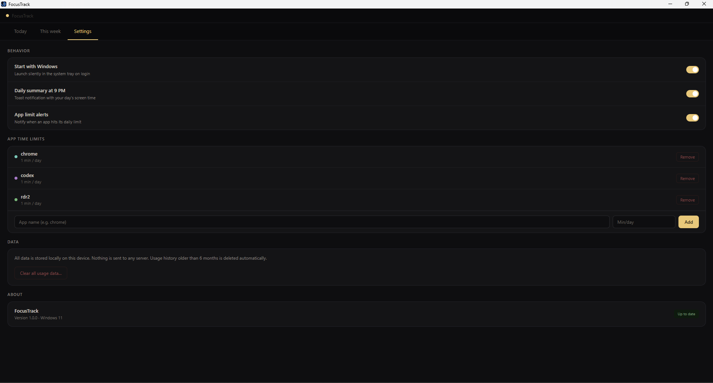

# FocusTrack

**A minimal, ultra-lightweight screen time tracker for Windows 11.**

FocusTrack silently monitors which apps you use and for how long — 
then presents everything in a clean, dark-themed dashboard.It is designed to be as non-intrusive as possible, consuming negligible system resources while keeping all your data 100% private and local. No admin rights, no installation, and no telemetry.


## Features

- 📊 **Daily Dashboard** — High-level overview of today's total usage and top apps.
- 📆 **Weekly Trends** — Interactive 7-day chart with deep-dive app breakdowns.
- 🎨 **Minimal Design** — Sleek, dark-themed dashboard that feels native to Windows 11.
- ⌛ **App Time Limits** — Stay focused by capping usage; get instant toast alerts when limits hit.
- 🌙 **Evening Recap** — Optional 9 PM notification summarizing your digital day.
- 🧹 **Zero Maintenance** — Intelligent auto-cleanup keeps your DB clean (older than 6 months).
- 🚀 **Built for Speed** — Blazing fast Go backend with a sub-12.46MB footprint.
- 🛡️ **Privacy First** — No cloud, no tracking. Just your data.

## Download

1. Go to [Releases](https://github.com/Kabshah/FocusTrack/releases)
2. Download `FocusTrack_1.0.0_windows_amd64.zip`
3. Extract the zip
4. Run `FocusTrack.exe`

## ⚠️ Windows SmartScreen Warning

When you first run FocusTrack, Windows may show a SmartScreen warning because the executable is not code-signed.

Click **"More info"** → **"Run anyway"** to proceed.

This is expected for open-source apps without a paid code signing certificate. The full source code is available in this repository for review.


## 📸 App in Action


### Daily Dashboard
*Track your real-time usage with app-specific session counts and duration.*


### Weekly Overview
*Analyze your digital trends with a 7-day bar chart and per-app breakdowns.*


### App Time Limits & Settings
*Configure notification alerts and set daily caps for distracting apps.*



# Tech Stack


| Layer | Technology |
|---|---|
| **Backend** | [Go 1.22+](https://go.dev/) (High-performance system logic) |
| **GUI Engine** | [Edge WebView2](https://developer.microsoft.com/en-us/microsoft-edge/webview2/) via `jchv/go-webview2` |
| **Frontend** | HTML5, Vanilla CSS3, JavaScript (ES6+) |
| **Database** | [SQLite](https://sqlite.org/) via `modernc.org/sqlite` (Pure Go) |
| **System Tray** | `github.com/getlantern/systray` (Native background integration) |
| **Notifications** | `github.com/go-toast/toast` (Native Windows Toast alerts) |
| **Registry** | `golang.org/x/sys/windows/registry` (Startup persistence) |
| **Deployment** | GoReleaser (Single executable) |

## Project Structure

```
FocusTrack/
├── cmd/focustrack/    # Entry point & Icon generation
├── internal/
│   ├── tracker/       # Windows active window polling logic
│   ├── storage/       # SQLite schema, queries, data cleanup
│   ├── aggregator/    # Daily/weekly stats computation
│   ├── config/        # Settings JSON persistence
│   └── notify/        # Windows toast notification bridge
├── ui/                # Go WebView2 bridge & Embedded server
│   └── frontend/      # HTML/CSS/JS source (Modern Dashboard UI)
├── assets/            # Windows manifest & build resources
├── .github/workflows/ # Automated CI/CD pipelines
└── .goreleaser.yaml   # Build & Release configuration
```

## How It Works

1. FocusTrack polls the active window every second using the Win32 API
2. When you switch apps, it updates the previous session and starts tracking the new one
3. Sessions are stored in a local SQLite database
4. The dashboard and weekly views query the DB and display usage stats
5. Data older than 6 months is automatically cleaned up

## Build from Source

**Requirements:** [Go 1.22+](https://go.dev/dl/), Windows

1. **Install dependencies**
   ```powershell
   go mod tidy
   ```

2. **Generate manifest** (Required for UI components to load correctly)
   ```powershell
   go generate ./cmd/focustrack/
   ```

3. **Build the executable**
   ```powershell
   # Build the silent desktop version (Recommended)
   go build -ldflags="-s -w -H windowsgui" -o FocusTrack.exe ./cmd/focustrack
   ```

> [!TIP]
> The `-H windowsgui` flag hides the background terminal console.
